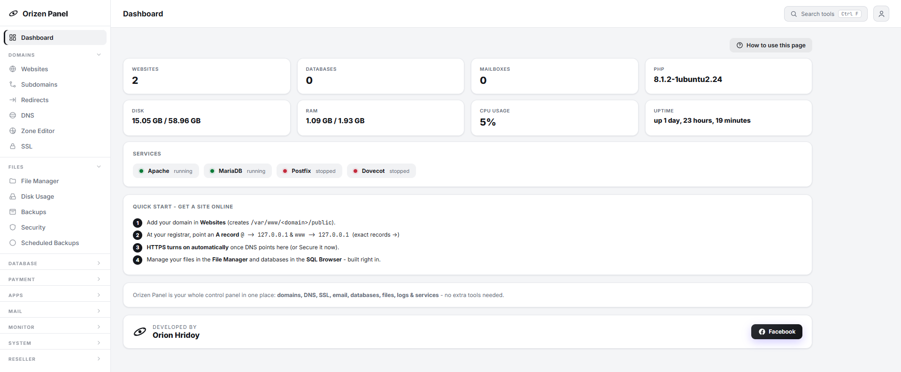
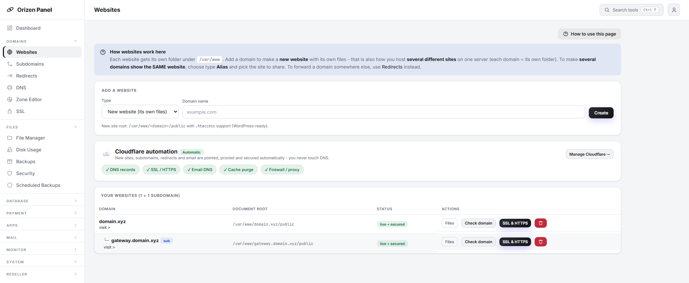
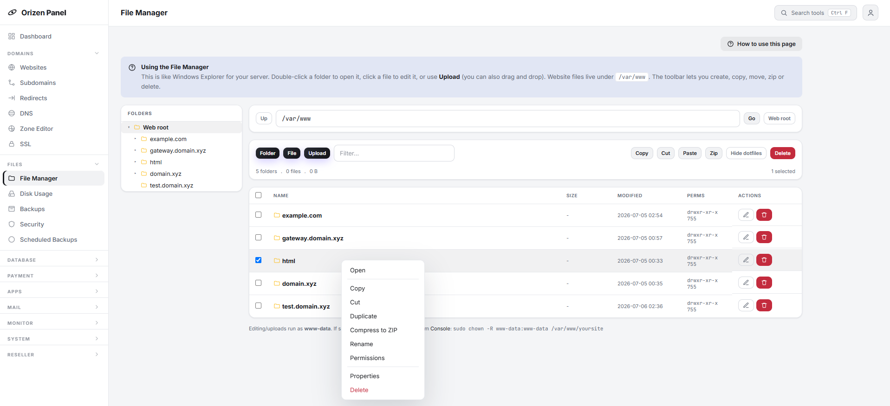
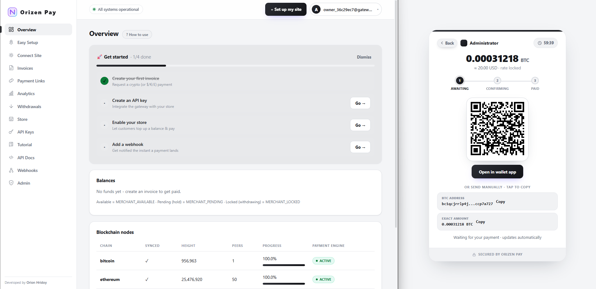

<h1 align="center">Orizen Panel - Web Hosting Control Panel with a Built‑in Self‑Hosted Crypto Payment Gateway (No KYC)</h1>

<p align="center"><b>One server. One panel. Host unlimited websites with automatic Cloudflare DNS + lifetime HTTPS - and deploy your own multi‑chain crypto payment gateway in one click.</b></p>

<p align="center">
  
  
  
  
  
  
</p>

> **Orizen Panel** is a free, self‑hosted **web hosting control panel** - a modern **cPanel / WHM alternative** - with a **built‑in self‑hosted cryptocurrency payment gateway (Orizen Pay)**. Manage domains, subdomains, DNS, SSL, email, databases, files, staging environments and cron/script jobs from one clean dashboard, and accept **Bitcoin and multi‑chain crypto payments** on any domain without a third‑party processor. Ideal for developers, agencies, resellers and anyone who wants **cloud hosting they fully own**.

---

## 📸 Screenshots

| Control panel dashboard | Websites + Cloudflare automation |
|---|---|
|  |  |

| File Manager (desktop right‑click) | Orizen Pay crypto checkout |
|---|---|
|  |  |

---

## ⭐ Why Orizen Panel?

Most control panels stop at hosting. Most payment gateways lock you into a processor that takes a cut, freezes funds, and owns your data. **Orizen does both, and you own all of it.**

- 🧩 **Two products, one interface** - a full hosting panel *and* a crypto payment gateway, deeply integrated.
- ☁️ **Cloudflare automation (optional)** - connect a token and every site is pointed, proxied and secured automatically; switch to **Manual mode** anytime and nothing breaks.
- 🖱️ **One‑click everything** - add a site, issue HTTPS, install WordPress, install a mail server, deploy a payment gateway, or run a background script - each in a click.
- 🔐 **You hold the keys** - self‑hosted wallets, self‑hosted checkout. No processor, no KYC middleman, no cut of your revenue.
- 🖥️ **Runs anywhere** - one installer, fully **cross‑distro** (Debian/Ubuntu, RHEL/Fedora/Rocky/Alma, openSUSE, Arch).
- 💸 **Free forever** - no licence fee, no per‑site pricing, no paid add‑ons.

---

## ✨ Features

### 🌐 Web hosting control panel
- **Websites & subdomains** - each gets its own folder; WordPress‑ready `.htaccess`; subdomains nest under their parent. **Alias** sites share one codebase across domains.
- **One‑click Cloudflare DNS + lifetime HTTPS** - connect a token and adding a site sets its DNS *and* issues an auto‑renewing certificate. Prominent per‑site controls: SSL mode, Always‑Use‑HTTPS, Automatic‑HTTPS‑Rewrites, server‑side **Force HTTPS**, and **Cache Purge**. Auto‑detects existing Let's Encrypt **or** Cloudflare certificates and lets you choose the provider.
- **Manual mode** - Cloudflare is always optional; every action works without it (traditional DNS instructions are shown instead).
- **Redirects (301/302)** - pick the source from **your added domains/subdomains**, forward it anywhere, with automatic origin‑SSL so Cloudflare "Full" never throws *invalid SSL certificate*. **Removing a redirect restores the site and never deletes its DNS** - nothing breaks.
- **Email & Webmail** - create `you@yourdomain` accounts (IMAP/SMTP + built‑in webmail). No mail server yet? A **one‑click "Install mail server"** button sets up Postfix + Dovecot + OpenDKIM for you; on Cloudflare it auto‑creates **MX, SPF, DKIM, DMARC**.
- **File Manager** - desktop‑style **right‑click menu** on both the file list **and the folder tree** (Open, Edit, Download, Copy, Cut, Paste, Duplicate, Compress, Extract, Permissions, **Properties**, Delete), multi‑select, keyboard shortcuts (Ctrl+A/C/X/V, Del), and drag‑and‑drop upload.
- **SQL Browser** - lazy‑loading (never auto‑queries `information_schema`): pick a database → tables → rows, on demand.
- **Databases, Backups, DNS / Zone Editor, Logs, Firewall, Processes, Monitoring.**
- **Staging** - clone a live site (files + database), auto‑provision the staging subdomain (generated / custom subdomain / custom domain) with Cloudflare DNS + HTTPS, then **push to production** with an automatic pre‑push backup.
- **Cron + Script Runner** - classic crontab *and* an interval script runner (every 10 s → hourly, or custom) with **start/stop** and **live logs**.
- **One‑Click Apps into existing sites** - WordPress, **WooCommerce**, Drupal, Joomla, Laravel, Next.js, Ghost, Node/Python/Docker: *Select website → Select app → Install*.
- **Hosting Accounts & Resellers** - WHM‑style packages, quotas, suspend and ownership transfer.
- **Security+** - 2FA, brute‑force lockouts, Fail2Ban management, ClamAV on‑demand scanning, login audit trail - all reachable from **Settings**.

### 🔐 Login security (panel **and** gateway)
- **Built‑in captcha** on every login - a self‑contained, offline SVG challenge (no third‑party keys, nothing leaves your box).
- **Two‑factor authentication, two ways:** an **authenticator app** (TOTP - Google Authenticator, Authy, 1Password…) **and/or Telegram** (a login code sent to your bot). Turn on either or both.
- **Staged login** - password first, then the second factor; brute‑force attempts are rate‑limited and locked out automatically.

### 💳 Orizen Pay - self‑hosted crypto gateway
- **Accept crypto directly** - **BTC, LTC, ETH, XRP, USDT (TRC‑20), USDC** - straight to wallets you control.
- **One‑click install onto any domain** - built in Docker, reverse‑proxied, and secured with Cloudflare HTTPS. Hands you a **fresh, random admin login**. Click **Open** from the panel and you're **signed in automatically** (secure panel→gateway SSO).
- **Zero blockchain storage** - every chain is read from an external RPC/explorer, so there are **no multi‑terabyte nodes to sync**. It uses **zero resources until you install one**.
- **Hosted checkout, payment links, invoices, a store balance system**, and a **Connect Store** generator producing ready‑to‑paste code (no‑code button *or* full API).
- **Ready‑made webhook handler** - the Webhooks page hands you a single self‑contained PHP file (Copy or Download) that verifies signatures for you; upload it, paste your `whsec_` secret, done.
- **Same login hardening** - captcha + authenticator/Telegram 2FA on the gateway too; new‑account registration is **off by default**.
- **Isolated signer, double‑entry ledger, HMAC‑signed API, webhooks** - built like it handles money, because it does.

---

## 🧰 Requirements

- A **fresh Linux VPS**. Fully cross‑distro: **Debian 11/12 · Ubuntu 20.04–24.04 · RHEL/Fedora/Rocky/Alma · openSUSE · Arch** (best‑effort). 1 vCPU / 2 GB RAM minimum; 2 vCPU / 4 GB recommended if you run a payment gateway.
- Root SSH access.
- A domain you control (optional but recommended). A free **Cloudflare** account unlocks the one‑click DNS + HTTPS automation.
- For USDT‑TRC20 payments: a free **TronGrid** API key (see below).

The installer provisions **everything needed for full operation** in one run: Apache + PHP (with imap/zip/gd/curl/mbstring/xml/intl/bcmath), MariaDB, Certbot, **Docker + Compose** (payment‑gateway engine), **Redis** object cache, **ClamAV**, **Fail2Ban**, and tools (git, unzip/zip, rsync, tar, jq, dig, htpasswd, cron). A mail server is one prompt away - or a one‑click install from the panel later.

---

## 🚀 Quick start (one command)

On a **fresh** server, copy this folder over and run:

```bash
ssh root@YOUR_SERVER
git clone https://github.com/orionhridoy/OrizenPanel.git
cd OrizenPanel
sudo bash install.sh --auto        # installs everything, prints a random login once
```

Then open **`https://YOUR_SERVER_IP:1337`**, accept the self‑signed cert, sign in - and head to **Crypto Gateway** to deploy your first crypto gateway on a domain.

---

## ⚙️ Configuration

Everything is managed in the panel - no config files to hand‑edit:

- **Settings → Change panel password.**
- **Settings → Two‑factor authentication** - set up an **authenticator app** and/or **Telegram**; a login **captcha** is always on.
- **Settings → Cloudflare** - connect one or more API tokens, switch Automatic/Manual mode, read the built‑in token guide.
- **Settings → Modules** - toggle optional features (Accounts/Resellers, REST API, Scheduled Backups, Docker, Security+, etc.).

Panel data lives in `/opt/orizen/data`; privileged actions run through a single **validated root helper** (`/usr/local/bin/orizen-helper`) via a locked sudoers rule.

---

## ☁️ Cloudflare setup (automatic DNS + HTTPS)

**Settings → Cloudflare → "Full step‑by‑step guide"** walks you through it in‑app. In short, create a **Custom API Token** at Cloudflare → *My Profile → API Tokens* with:

| Group | Item | Access |
|---|---|---|
| Zone | DNS | Edit |
| Zone | Zone Settings | Edit |
| Zone | SSL and Certificates | Edit |
| Zone | Cache Purge | Purge |
| Zone | Zone | Read |

Set **Zone Resources → Include → All zones**, create, copy the token once, and paste it into **Settings → Cloudflare → Add account**. Add several tokens to manage several Cloudflare accounts/sites. **Manual mode** disables all automation while keeping every feature working.

---

## 🔐 Two‑factor authentication setup

2FA protects both the **panel** (Settings → Two‑factor authentication → Security+) and each **gateway** (Settings → Two‑factor authentication):

- **Authenticator app** - click *Set up*, scan the QR (or paste the key), enter the 6‑digit code. Every login then asks for an app code.
- **Telegram** - create a bot with **@BotFather**, press **Start** on it, find your numeric chat ID (e.g. via **@userinfobot**), paste both, get a test code, and enable. Login codes then arrive on Telegram.

Turn on either or both. A login **captcha** is always on and needs no setup.

---

## 📧 Mail server setup

Open **Email**. If a mail server isn't installed yet, click **Install mail server** - Orizen installs and configures **Postfix + Dovecot + OpenDKIM** (cross‑distro) and opens the mail ports. Then create `you@yourdomain` accounts in one step (the mail domain is set up automatically the first time). With Cloudflare connected, the **MX/SPF/DKIM/DMARC** records are published for you; otherwise the exact records to copy appear on the **DNS** page.

---

## 🪙 Tron (USDT‑TRC20) setup

To accept USDT on Tron you supply **your own** TronGrid key (Orizen never ships a hardcoded key):

1. Go to **trongrid.io → Get Started** (or `dashboard.trongrid.io`) and sign up.
2. Open **API Keys → Create API Key**, name it, keep **Mainnet**, click **Create**.
3. Copy the key and paste it into the **TronGrid API key** field when installing the gateway.

The free tier is plenty for most stores. BTC/LTC/ETH/XRP need no key.

---

## ⏱️ Cron & script runner setup

- **Script runner** (Cron page) - pick a script under `/var/www`, `/srv` or `/opt/orizen/data/scripts`, choose an interval (10 s / 30 s / 1 m / 5 m / 15 m / 1 h / custom), and **Start**. Watch **live logs**, **Stop** anytime. The interpreter is auto‑selected from the extension (`.php .py .js .sh`) and the script runs as the web user.
- **Crontab** - classic time‑of‑day jobs (e.g. `0 3 * * * php /var/www/site/cron.php`).

---

## 🛒 Connect Store setup (Orizen Pay)

Inside the gateway, **Connect Site / Easy Setup** generates everything you need:

1. Create an **API key** (API Keys page) - copy the key **and** secret (shown once).
2. Grab the SDKs - `orizen.php` / `orizen.js` (and `orizen-config.php`) from [`docs/integration/`](docs/integration/).
3. On the **Webhooks** page, add your endpoint, then **Copy or Download the ready‑made `orizen-webhook.php`** handler, upload it to your site, and paste in the `whsec_` secret it shows.
4. Paste the generated **payment button** (no‑code) or **API** snippet into your store.
5. The handler verifies every delivery on the raw body (`X-Orizen-Signature` + `X-Orizen-Timestamp`) before you trust it - no crypto code to write.

---

## 🧪 Staging setup

**Staging** page → choose a source website, pick a staging address (**Auto subdomain**, **Custom subdomain**, or **Custom domain**), and create. Orizen copies files + database, adjusts WordPress URLs, and - if Cloudflare is connected - points, proxies and secures the staging domain automatically. When it looks good, **Push to production** (a pre‑push backup is saved first).

---

## 🔌 API usage

The gateway exposes an HMAC‑signed REST API (`/api/v1`). Every request carries `X-API-KEY`, `X-TIMESTAMP` (ms) and `X-SIGNATURE = HMAC‑SHA256(secret, "timestamp.METHOD.path.sha256(body)")`. Webhooks are signed with `X-Orizen-Signature: v1=HMAC‑SHA256(secret, "timestamp.rawBody")` and `X-Orizen-Timestamp` (ms). The panel also has an optional **REST API + CLI** (Settings → Modules) to script every panel action. The `orizen.php` / `orizen.js` SDKs - and the ready‑made webhook handler - sign requests and verify webhooks for you.

---

## 🔒 Security

- **Login captcha + 2FA everywhere** - a built‑in offline captcha on every login, plus optional authenticator‑app and/or Telegram two‑factor, with automatic brute‑force lockout.
- Panel runs unprivileged; a single **validated root helper** performs privileged actions (every argument is pattern‑checked).
- Each payment gateway is an **isolated Docker stack**; the signer sits on its own network the API can't reach.
- **Secrets are shown once and never stored**; the panel never stores gateway passwords (panel→gateway SSO uses a shared signed secret, not your password). Staged config is `chmod 600` and shredded after deploy.
- Gateway **self‑registration is off by default**; the bare server IP never exposes a customer site or gateway.
- **No raw errors** - stack traces / SQL / filesystem details are logged internally; users only see friendly messages.

---

## ❓ FAQ

**Is it really free?** Yes - no licence, no per‑site fee, no paid add‑ons.
**Do I need Cloudflare?** No. It's an optional enhancement; Manual mode keeps everything working with traditional DNS.
**Do I need to run blockchain nodes?** No - Orizen Pay reads chains from external RPC/explorers (zero storage) and uses no resources until you install a gateway.
**Can I host multiple sites / resell hosting?** Yes - unlimited sites, plus WHM‑style Accounts & Resellers with packages and quotas.
**Which OS?** Cross‑distro: Debian/Ubuntu, RHEL/Fedora/Rocky/Alma, openSUSE, and Arch (best‑effort). One installer handles them all.
**Does the installer set everything up?** Yes - web/PHP, database, HTTPS tooling, Docker, Redis, ClamAV, Fail2Ban and all supporting tools are installed in one run. Mail is one click away.

---

## 🛠️ Troubleshooting

- **"Not working" on an action** - full details are in `/opt/orizen/data/logs/error.log`.
- **HTTPS shows 526 / invalid SSL certificate** - issue a Let's Encrypt origin cert from the site's **SSL & HTTPS** panel (Cloudflare "Full" needs a valid origin cert).
- **Gateway shows 502 for a minute after install** - normal while its Docker containers build on first run.
- **Email says the mail server isn't installed** - open **Email → Install mail server** (one click), then create accounts.
- **USDT payments not detected** - add a TronGrid API key (above).
- **File "not writable" / delete fails** - the File Manager falls back to a root‑level delete; for edits, fix ownership: `sudo chown -R www-data:www-data /var/www/yoursite`.

---

## 🆚 Orizen vs. the alternatives

| | **Orizen Panel** | cPanel / WHM | Plain payment processor |
|---|:---:|:---:|:---:|
| Price | **Free** | Paid licence | % of every sale |
| Self‑hosted | ✅ | ✅ | ❌ |
| Built‑in crypto payments | ✅ | ❌ | n/a |
| You control the wallets/funds | ✅ | - | ❌ |
| Cloudflare one‑click DNS + HTTPS | ✅ | ❌ | n/a |
| Login captcha + app/Telegram 2FA | ✅ | partial | varies |
| One‑command install | ✅ | ✅ | n/a |

---

<p align="center"><sub>
<b>Keywords:</b> self-hosted web hosting control panel · cPanel alternative · WHM alternative · free hosting panel ·
cloud hosting · website management · developer hosting tools · web panel · Cloudflare DNS automation · staging environments ·
one-click WordPress / WooCommerce · self-hosted crypto payment gateway · accept Bitcoin payments · BTC LTC ETH XRP USDT USDC ·
non-custodial crypto checkout · two-factor authentication · Docker · cross-distro Linux VPS (Debian · Ubuntu · RHEL · SUSE · Arch).
</sub></p>

<p align="center"><sub>Built by <b>Orion Hridoy</b> · Orizen Panel + Orizen Pay.</sub></p>
